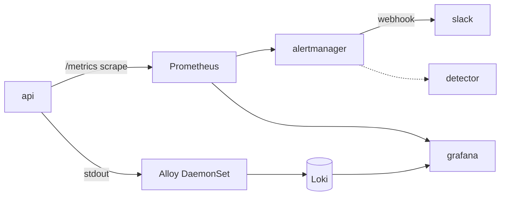
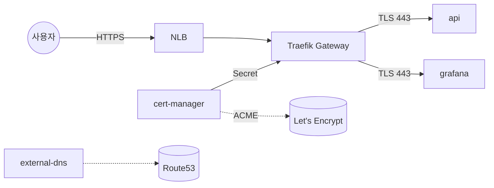
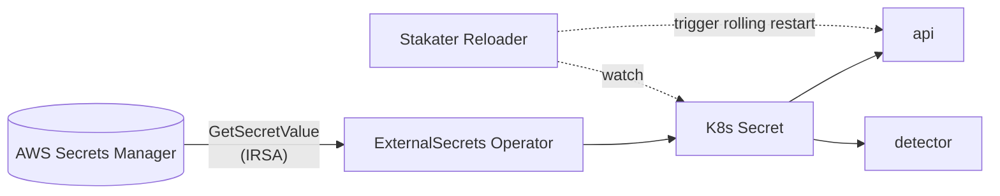
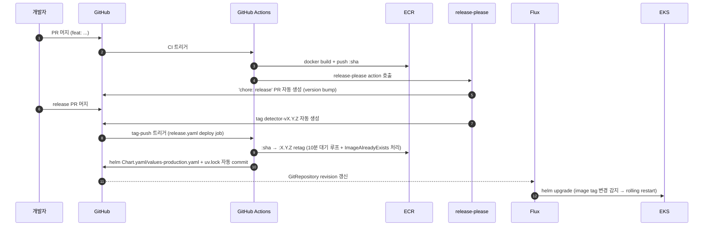
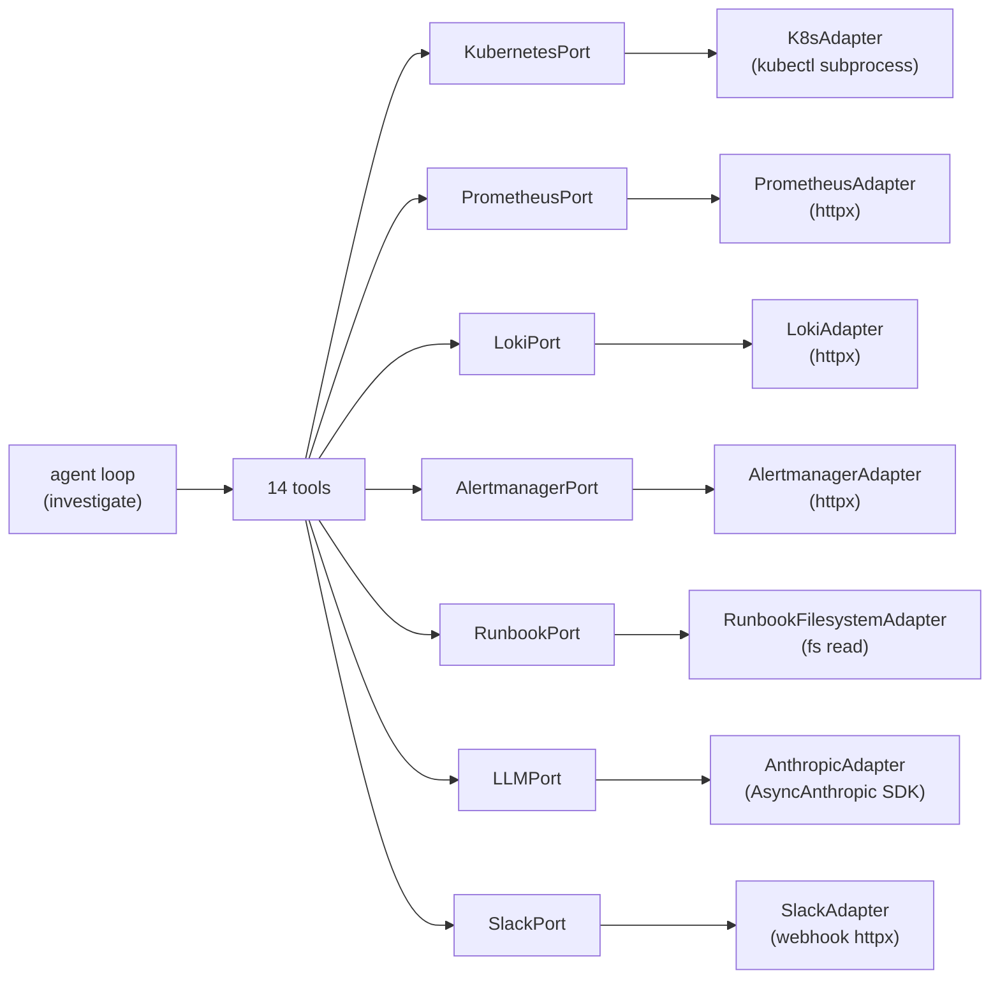
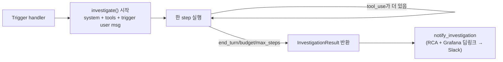
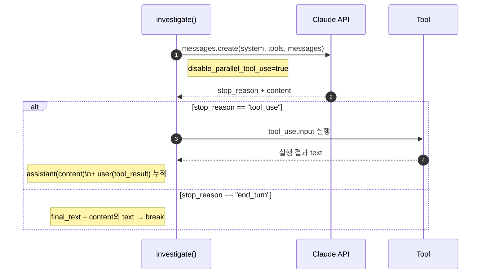
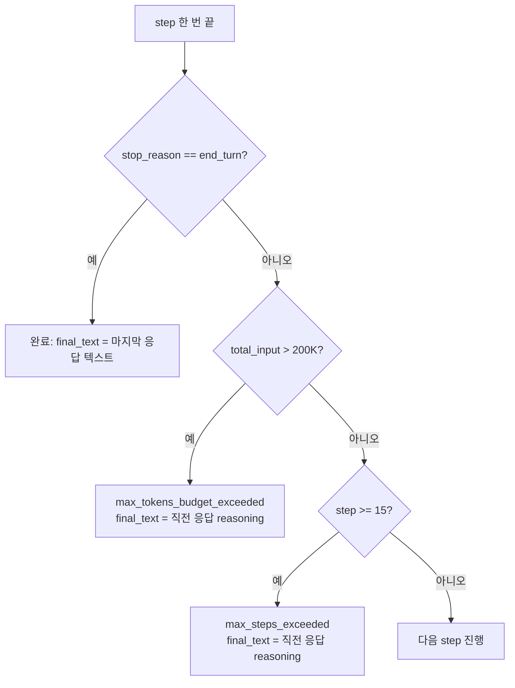
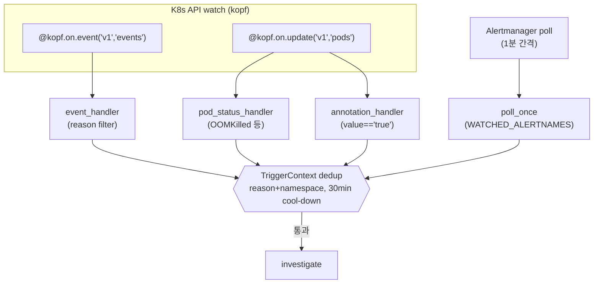
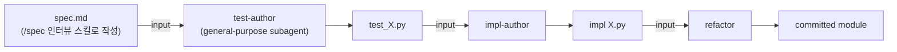

# devopsim — DevOps 시뮬레이터 + Agentic SRE Detector

## 0. 개요

| 항목 | 내용 |
|---|---|
| **한 줄 요약** | EKS에 배포한 모노레포 API + 자체 chaos endpoint에 대해 Claude 기반 agentic detector가 K8s 이벤트·메트릭·알람을 받아 RCA를 자동 작성하는 학습용 시뮬레이터 |
| **학습 목표** | Terraform/EKS/Karpenter/Observability/Networking/CI-CD/Agentic AI를 end-to-end로 직접 운영하며 trade-off를 체득 |
| **운영 검증** | EKS prod 클러스터에서 demo 5종 실행, 3건 성공 — RCA가 5분 안에 Slack 도착 |
| **주요 기술** | AWS EKS · Terraform · Flux · GitHub Actions · release-please · Prometheus · Loki · Grafana · Traefik (Gateway API) · cert-manager · ExternalSecrets · Stakater Reloader · Karpenter · Fastify (Node) · uv (Python) · Anthropic SDK · kopf |

---

## 1. 시스템 아키텍처

### 1.1 다이어그램

- 이미지 예정

### 1.2 컴포넌트 표

| 컴포넌트 | 역할 | 위치 |
|---|---|---|
| `api` | Fastify CRUD + chaos endpoint | EKS / namespace `api` |
| `detector` | Agentic SRE — K8s event/alert watch + LLM RCA | EKS / namespace `detector` |
| `kube-prometheus-stack` | 메트릭 + 알람 + Grafana | namespace `monitoring` |
| `loki + alloy` | 로그 수집/조회 | namespace `monitoring` |
| `traefik` | Gateway API + TLS termination + rate limit | namespace `traefik` |
| `flux` | GitOps reconciler | namespace `flux-system` |
| `ExternalSecrets` | AWS Secrets Manager → K8s Secret | namespace `external-secrets` |
| `Stakater Reloader` | Secret/ConfigMap 변경 시 Pod rolling restart | cluster-wide |
| `Karpenter` | 노드 자동 프로비저닝 | namespace `karpenter` |
| `cert-manager` | TLS 인증서 발급 (Let's Encrypt) | namespace `cert-manager` |
| `external-dns` | Route53 DNS 자동 등록 | namespace `external-dns` |

---

## 2. 인프라 (AWS / Terraform / EKS)

`infra/terraform/` 모듈 구조:
```
prod/
modules/
  vpc/     ── 10.0.0.0/16 + 2 AZ
  eks/     ── 1.35 cluster + node group + IRSA
  ecr/     ── api / detector repository
  rds/     ── PostgreSQL 16 primary + replica
  iam/     ── GHA OIDC role + ECR push policy
  loki/    ── S3 buckets + IAM
  dns/     ── Route53 + external-dns IRSA
```

핵심 의사결정:
- **t3a.medium × 4** — t3a가 t3보다 ~10% 저렴
- **S3 Gateway VPC Endpoint** — Loki chunk, terraform state의 S3 트래픽이 NAT를 거치지 않게
- **Karpenter on-demand only** — 시뮬레이터 안정성 우선 (spot 미사용)

---

## 3. 애플리케이션 (api)

### 3.1 구조
```
src/
  domain/         도메인 타입 + 레포지토리 인터페이스
  repositories/   DB 구현체
  services/       비즈니스 로직
  routes/         요청/응답 + DI
  plugins/        Fastify plugin (DB read/write split)
  errors.ts       AppError 중앙화
```

### 3.2 chaos endpoint

prod에서 incident를 인위적으로 만드는 9개 endpoint.

| Endpoint | 효과 |
|---|---|
| `GET /chaos/cpu?ms=N` | 이벤트 루프 N ms 점유 |
| `POST /chaos/cache/flush` | popular 캐시 키 삭제 |
| `GET /chaos/cache/slow?ms=N` | Redis 호출 후 sleep |
| `GET /chaos/db/slow?seconds=N` | `pg_sleep(N)` |
| `GET /chaos/db/burst?count=N` | 동시 query N개 |
| `GET /chaos/db/error` | 잘못된 SQL → 5xx |
| `POST /chaos/memory-leak` | setInterval로 heap 누수 |
| `POST /chaos/memory-leak/stop` | 누수 중단 |
| `POST /chaos/crash` | `process.exit(1)` |

---

## 4. Observability


```mermaid
flowchart LR
  api -- "/metrics scrape" --> prom[Prometheus]
  api -- stdout --> alloy[Alloy DaemonSet]
  alloy --> loki[(Loki)]
  prom --> alertmanager
  prom --> grafana
  loki --> grafana
  alertmanager -- webhook --> slack
  alertmanager -.-> detector
```

- **kube-prometheus-stack** Helm chart. defaultRules 중 EKS managed 컴포넌트는 비활성 (`kubeSchedulerAlerting/Recording`, `kubeControllerManager`, `etcd`)
- **PrometheusRule** — api(5), db(2), cache(1), detector(4), cni(2) — 모든 api alert에 `namespace: api` label 강제 (detector poller 호환)
- **Grafana dashboard** 2종: `devopsim-api`, `devopsim-detector`. ConfigMap의 `grafana_dashboard: "1"` label로 sidecar가 자동 import

---

## 5. Networking


```mermaid
flowchart LR
  user(("사용자")) -- HTTPS --> nlb[NLB]
  nlb --> traefik[Traefik Gateway]
  traefik -- TLS 443 --> api
  traefik -- TLS 443 --> grafana
  certmgr[cert-manager] -. ACME .-> letsencrypt[(Let's Encrypt)]
  certmgr -- Secret --> traefik
  extdns[external-dns] -.-> route53[(Route53)]
```

- **Traefik Gateway API** + NLB (AWS LoadBalancer) — ALB Ingress 단일화 시도 후 NLB로 정리
- **cert-manager** + Let's Encrypt DNS-01 challenge — Route53 IRSA (Route53에 _acme-challenge.devopsim.cloud TXT 레코드를 token 값으로 추가하는 권한)
- **external-dns** — HTTPRoute의 hostname을 자동으로 Route53 record로

---

## 6. Secrets / Auth


```mermaid
flowchart LR
  sm[(AWS Secrets Manager)] -- "GetSecretValue\n(IRSA)" --> eso[ExternalSecrets Operator]
  eso --> k8sSecret[K8s Secret]
  k8sSecret --> api
  k8sSecret --> detector
  reloader[Stakater Reloader] -. watch .-> k8sSecret
  reloader -. trigger rolling restart .-> api
```

- AWS Secrets Manager에 앱 시크릿 저장
- ExternalSecret이 K8s Secret으로 sync
- **Stakater Reloader** — Secret 데이터 hash 변경 시 자동 Pod restart

---

## 7. CI/CD / GitOps


```mermaid
sequenceDiagram
  autonumber
  participant dev as 개발자
  participant gh as GitHub
  participant gha as GitHub Actions
  participant ecr as ECR
  participant rp as release-please
  participant flux as Flux
  participant eks as EKS

  dev->>gh: PR 머지 (feat: ...)
  gh->>gha: CI 트리거
  gha->>ecr: docker build + push :sha
  gha->>rp: release-please action 호출
  rp->>gh: 'chore: release' PR 자동 생성 (version bump)
  dev->>gh: release PR 머지
  rp->>gh: tag detector-vX.Y.Z 자동 생성
  gh->>gha: tag-push 트리거 (release.yaml deploy job)
  gha->>ecr: :sha → :X.Y.Z retag (10분 대기 루프 + ImageAlreadyExists 처리)
  gha->>gh: helm Chart.yaml/values-production.yaml + uv.lock 자동 commit
  gh-->>flux: GitRepository revision 갱신
  flux->>eks: helm upgrade (image tag 변경 감지 → rolling restart)
```

- **GHA OIDC** — long-lived AWS key 없이 IRSA로 ECR push
- **release-please** — conventional commits 기반 자동 버전. node + python release-type 동시 지원
- **release.yaml에 `uv lock` 단계 추가** — release-please가 pyproject.toml만 bump하고 uv.lock 안 건드려 매번 drift 발생 → 영구 해결
- **Flux** — `reconcileStrategy: Revision` — GitRepository revision 변경 시 강제 helm upgrade

---

## 8. Agentic Detector

### 8.1 설계 — Port-Adapter + Tool factory

각 외부 시스템(K8s/Prom/Loki/Alertmanager/Runbook/LLM/Slack)을 **Protocol(Port)** 로 정의 + **Adapter**로 구현 + **make_X_tool(port, ...) factory**로 Anthropic tool schema 노출. 테스트는 Protocol을 fake로 대체.


```mermaid
graph LR
  loop["agent loop\n(investigate)"]
  loop --> tools["14 tools"]
  tools --> port_k8s["KubernetesPort"]
  tools --> port_prom["PrometheusPort"]
  tools --> port_loki["LokiPort"]
  tools --> port_am["AlertmanagerPort"]
  tools --> port_rb["RunbookPort"]
  tools --> port_llm["LLMPort"]
  tools --> port_slack["SlackPort"]
  port_k8s --> adapter_k8s["K8sAdapter\n(kubectl subprocess)"]
  port_prom --> adapter_prom["PrometheusAdapter\n(httpx)"]
  port_loki --> adapter_loki["LokiAdapter\n(httpx)"]
  port_am --> adapter_am["AlertmanagerAdapter\n(httpx)"]
  port_rb --> adapter_rb["RunbookFilesystemAdapter\n(fs read)"]
  port_llm --> adapter_llm["AnthropicAdapter\n(AsyncAnthropic SDK)"]
  port_slack --> adapter_slack["SlackAdapter\n(webhook httpx)"]
```

도구 14개: read 11개 (kubectl_get/describe/logs/events/rollout_history, promql_query/range, loki_query/range, alertmanager_list_alerts, fetch_runbook) + write 3개 (restart_deployment, scale_deployment, delete_pod).

### 8.2 LLM agent loop


#### (A) 전체 흐름


```mermaid
flowchart LR
  trig[Trigger handler] --> setup["investigate() 시작\nsystem + tools + trigger user msg"]
  setup --> step[한 step 실행]
  step -->|"tool_use가 더 있음"| step
  step -->|"end_turn/budget/max_steps"| result[InvestigationResult 반환]
  result --> notify["notify_investigation\n(RCA + Grafana 딥링크 → Slack)"]
```

**해석**: 트리거 핸들러(4종 중 하나)가 `investigate()` 를 호출한다. 첫 호출 시 시스템 프롬프트와 14개 tool 스키마, trigger 정보를 묶어 Claude에 보낸다. 그 다음 "한 step"을 반복 실행하며 Claude가 tool을 더 요청하면 계속 돌고, 종료 신호가 오면 빠져나와 결과를 Slack으로 보낸다.

#### (B) 한 step 안에서 일어나는 일

##### 매 호출에 들어가는 프롬프트 구성

| 위치 | 내용 | 소스 |
|---|---|---|
| `system` block | 역할 + cluster context (`load_cluster_context()` 가 채움). `cache_control: ephemeral` 로 prompt cache 적용 | [`detector/prompts/system.md`](../packages/detector/detector/prompts/system.md) |
| 첫 user message | `{trigger_summary}` (trigger dict 통째) + `{runbook_catalog}` (사용 가능한 runbook 목록). LLM이 어떤 runbook을 fetch할지 결정하는 신호 | [`detector/prompts/investigation.md`](../packages/detector/detector/prompts/investigation.md) |
| 누적 messages | step 진행하며 `assistant(content)` + `user(tool_result)` 가 번갈아 누적. 매 step마다 system + 누적 messages 전체를 다시 보냄 | [`detector/agent/loop.py`](../packages/detector/detector/agent/loop.py) `investigate()` |
| `tools` 파라미터 | 14개 tool 스키마 (Pydantic input model → Anthropic JSON schema). LLM이 호출 가능한 도구 명세 | [`detector/agent/tools/`](../packages/detector/detector/agent/tools/) |
| Slack 메시지 (종료 후) | `{rca}` + `{actions_taken}` + `{links}` 템플릿. 최종 결과 포맷팅 | [`detector/prompts/slack_report.md`](../packages/detector/detector/prompts/slack_report.md) |

조립은 [`loop.py::_build_system_blocks`](../packages/detector/detector/agent/loop.py) (system) + [`loop.py::_build_initial_user_message`](../packages/detector/detector/agent/loop.py) (첫 user) 가 담당.

##### Step의 단일 사이클


```mermaid
sequenceDiagram
  autonumber
  participant inv as investigate()
  participant claude as Claude API
  participant tool as Tool

  inv->>claude: messages.create(system, tools, messages)
  Note right of inv: disable_parallel_tool_use=true
  claude-->>inv: stop_reason + content

  alt stop_reason == "tool_use"
    inv->>tool: tool_use.input 실행
    tool-->>inv: 실행 결과 text
    Note left of inv: assistant(content)\n+ user(tool_result) 누적
  else stop_reason == "end_turn"
    Note left of inv: final_text = content의 text → break
  end
```

**해석**: 매 step에서 Claude에게 누적된 대화(system + messages)와 도구 목록을 보낸다. Claude의 응답에 `tool_use` 블록이 있으면 그 도구를 실제로 실행하고 결과를 다음 user 메시지로 누적한다. `end_turn` 이면 그 응답에 담긴 텍스트가 최종 RCA가 된다. `disable_parallel_tool_use=true` 옵션으로 한 응답 안에 여러 tool_use가 묶이지 않도록 막아 우리 루프가 직렬로 처리할 수 있게 한다.

#### (C) 종료 분기 — step이 끝날 때마다 검사


```mermaid
flowchart TD
  s["step 한 번 끝"] --> chk1{"stop_reason == end_turn?"}
  chk1 -->|"예"| done["완료: final_text = 마지막 응답 텍스트"]
  chk1 -->|"아니오"| chk2{"total_input > 200K?"}
  chk2 -->|"예"| budget["max_tokens_budget_exceeded\nfinal_text = 직전 응답 reasoning"]
  chk2 -->|"아니오"| chk3{"step >= 15?"}
  chk3 -->|"예"| maxs["max_steps_exceeded\nfinal_text = 직전 응답 reasoning"]
  chk3 -->|"아니오"| more["다음 step 진행"]
```

**해석**: 한 step이 끝날 때마다 종료 조건 3개를 차례로 본다.
1. **`end_turn`** — Claude가 더 이상 도구가 필요 없다고 판단 → 정상 종료. 그 응답의 텍스트가 final RCA.
2. **입력 토큰 누적 200K 초과** — 한 incident에 너무 많은 비용이 누적되지 않도록 차단. 다만 빈 RCA가 가지 않도록 직전 응답의 reasoning 텍스트를 final_text로 보존.
3. **step 15회 도달** — 무한 loop 방지. 마찬가지로 직전 reasoning 보존.
어느 조건에도 안 걸리면 다음 step으로.

#### 핵심 guard rail (요약)
- `disable_parallel_tool_use=true` — Claude가 한 응답에 여러 tool_use 묶지 않도록 강제 (400 에러 회피)
- `MAX_STEPS=15` / `MAX_TOTAL_INPUT_TOKENS=200_000` — 무한 loop / 비용 폭주 방지
- budget·max_steps 초과 시 직전 응답의 reasoning 텍스트를 `final_text`로 보존 (빈 RCA 회피)
- 빈 text 블록 필터 — 빈 텍스트를 그대로 다음 요청에 보내면 Anthropic API 400 거부됨

### 8.3 트리거 채널 4종


```mermaid
flowchart TB
  subgraph k8s["K8s API watch (kopf)"]
    on_event["@kopf.on.event('v1','events')"]
    on_update["@kopf.on.update('v1','pods')"]
  end
  poller["Alertmanager poll\n(1분 간격)"]

  on_event --> ev_handler["event_handler\n(reason filter)"]
  on_update --> pod_handler["pod_status_handler\n(OOMKilled 등)"]
  on_update --> ann_handler["annotation_handler\n(value=='true')"]
  poller --> al_handler["poll_once\n(WATCHED_ALERTNAMES)"]

  ev_handler --> dedup
  pod_handler --> dedup
  ann_handler --> dedup
  al_handler --> dedup
  dedup{{"TriggerContext dedup\nreason+namespace, 30min cool-down"}}
  dedup -->|"통과"| investigate
```

| Trigger | 발화 조건 | dedup key |
|---|---|---|
| **K8s Event** | `WATCHED_EVENT_REASONS = {BackOff, CrashLoopBackOff, Failed, FailedScheduling, Unhealthy}` + `allowed_namespaces=("api",)` | `event:{reason}:{namespace}` |
| **Pod status update** | `containerStatuses[*].lastState.terminated.reason in {OOMKilled}` | `pod:{reason}:{namespace}` |
| **Annotation** | `metadata.annotations["detector.devopsim.cloud/investigate"] == "true"` | `annotation:{namespace}:{name}` |
| **Alertmanager poll** | `WATCHED_ALERTNAMES = {DBPoolWaiting, HighCPU, HighErrorRate}` + alert의 `labels.namespace in allowed_namespaces` | `alert:{alertname}:{namespace}` |

dedup은 `reason+namespace` 단위 30분 cool-down — rolling restart로 매번 새 pod 이름이 생겨도 burst trigger를 1건으로 묶음.

### 8.4 안전 장치

- `allowed_namespaces=("api",)` — 화이트리스트 통과해야 모든 handler 동작
- `dry_run` config — write tool 호출 시 `kubectl --dry-run=server`로 검증만
- write tool은 **3개만** — `restart_deployment` / `scale_deployment` / `delete_pod`. 모두 Deployment controller가 자동 회복시키는 idempotent 액션. `kubectl edit/apply/patch`, secret 변경, node drain, RBAC 변경은 tool로 제공 안 함 (의도된 제한)

### 8.5 메트릭 + Grafana dashboard + PrometheusRule

| 메트릭 | 타입 | 라벨 |
|---|---|---|
| `detector_investigations_total` | Counter | trigger, result(stop_reason) |
| `detector_tool_calls_total` | Counter | tool, status(ok/error) |
| `detector_investigation_duration_seconds` | Histogram | — |
| `detector_tokens_used_total` | Counter | type(input/output/cache_read) |

Grafana 대시보드 `devopsim-detector`: investigations rate(by trigger/result) / duration p50·p95·p99 / tool calls by tool·status / token usage.

PrometheusRule `detector.rules` 4건 + `cni.rules` 2건.

### 8.6 Claude code workflow

각 신규 기능: spec.md → test-author agent (spec만 입력) → impl-author agent (test만 입력) → refactor agent (impl + 결과만 입력). 각 sub-agent는 fresh context로 spawn — 부모 conversation 자체를 못 봐 spec drift 차단.


```mermaid
flowchart LR
  spec["spec.md\n(/spec 인터뷰 스킬로 작성)"]
  spec -- "input" --> testa["test-author\n(general-purpose subagent)"]
  testa --> testfile["test_X.py"]
  testfile -- "input" --> impla["impl-author"]
  impla --> implfile["impl X.py"]
  implfile -- "input" --> refa["refactor"]
  refa --> committed["committed module"]
```

세 단계 모두 자동 검증 통과 + 사용자 승인 후 커밋.

---

## 9. 운영 검증 (Demo 5종)

EKS prod 클러스터에서 실행, `docs/chaos/v2/` 에 raw log + 상세 분석.

| Demo | Trigger | LLM 응답 | 결과 |
|---|---|---|---|
| 1 HighErrorRate | `/chaos/db/error` × 1초 × 5분 → alert sustained | 6 step → end_turn → Slack RCA | **성공** |
| 2 Slow query | `/chaos/db/slow` × 5초 × 10분 | (alert firing 안 됨) | timeout — `pg_sleep` metric 미수집 |
| 3 Image pull error | `kubectl set image broken-tag` → ImagePullBackOff | ~50초 → Slack RCA (rollback 권고) | **성공** |
| 4 Annotation | `kubectl annotate pod ...` | ~80초 → Slack RCA | **성공** |
| 5 Redis down | `kubectl delete pod -n redis` | (cascade 없음) | timeout — Deployment 즉시 재생성 |

성공 3건이 보여준 가치: **사람의 의사결정을 5분 안에 압축하는 RCA** (자율 조치 시현보다 진짜 prod 가치).

---

## 10. 트러블슈팅 사례

| # | 증상 | 진짜 원인 | fix | 학습 |
|---|---|---|---|---|
| 1 | `system.md`에 작성한 system prompt 정책이 LLM 응답에 안 먹힘 | `loop._build_system_blocks` 가 영어 hardcode intro만 보내고 `system.md` 파일은 import만 되고 호출 경로에 없었음 | `render_prompt("system", ...)` 로 리팩토링해 `.md` 파일이 진짜로 LLM에 전달되도록 | 설정 파일과 실제 코드 경로가 일치하는지 deploy 후 smoke로 검증 |
| 2 | Anthropic API 400 errors | (a) 빈 text 블록을 assistant turn에 다시 보냄 (b) parallel tool_use 응답을 우리 loop가 첫 번째만 처리 | 빈 text 블록 필터링 + `tool_choice.disable_parallel_tool_use=true` | LLM API의 invariant 검증 (응답 → 다음 요청 형식) |
| 3 | Demo 1 sustained alert이 firing 됐지만 detector 무시 | PrometheusRule이 `labels.namespace` 미설정 → alertmanager poller가 화이트리스트로 걸러냄 | api alert 6개에 `namespace: api` label 추가 | 두 시스템의 contract(label scheme) 확인 |

---

## 11. 한계와 trade-off

### 11.1 시뮬레이터의 본질적 한계
- **chaos endpoint는 단발 호출** — prod chaos 도구(Gremlin/Chaos Mesh)는 minutes~hours 단위 실험 + control plane(webhook/annotation/CRD)으로 신호 분리. 우리는 그 분리를 못 함 → demo 1·2에서 sustained loop을 별도로 구성
- **Deployment의 자동 회복** — prod에서는 강점이지만 시뮬레이터에서는 cascade 차단(demo 5)

### 11.2 자율 조치 vs RCA — 정직한 평가
- detector가 가진 write tool 3개(restart/scale/delete)는 kubelet/HPA/Deployment가 이미 잘 푸는 영역
- 진짜 회복은 코드 fix / image rollback / config 변경 — detector 권한 밖
- → **자율 조치 시연은 좁은 가치, RCA가 진짜 차별점** (의사결정 압축)

---

## 12. 회고 — 다음에 다르게 할 것

| 잘 한 것 | 헛디딘 것 | 다음에 다르게 할 것 |
|---|---|---|
| Port-Adapter + Tool factory로 detector 테스트 가능하게 | system.md 파일이 실제로 LLM에 안 들어가는 걸 deploy 후 발견 | 신규 패턴 도입 시 end-to-end smoke 우선 |
| TDD with isolated sub-agents — spec drift 막음 | demo 시나리오 1차에서 OOM/CrashLoop으로 갔다가 폐기 | 시연 가치를 먼저 합의하고 시나리오 설계 |
| release.yaml의 `uv lock` 단계로 drift 영구 해결 | 매 release마다 lock drift commit 3회 반복 후에야 패턴 인지 | 동일 chore가 2회 반복되면 자동화 |

학습 성과:
- agentic AI의 **자율 vs 안전**의 균형 — write tool 화이트리스트 + dry_run + namespace 제한 + 보수적 system prompt
- prod **chaos engineering**의 control-plane 분리 원칙 (application log에 self-disclose 금지)
- **GitOps의 자동화 layer 결합** — release-please + Flux + Helm 각자의 책임 경계

---

## 13. 후속 작업 후보

- **Phase G — Runbook self-learning** — RCA 결과를 새 runbook으로 자동 저장 + 다음 incident에서 LLM이 참조
- **Phase H — Agent eval cycle** — 동일 incident에 대한 RCA를 LLM-as-judge로 점수 + 회귀 추적

---

## 부록 A — 핵심 파일 위치

| 영역 | 경로 |
|---|---|
| Terraform | `infra/terraform/{prod,modules}/` |
| Helm chart | `infra/helm/{api,db,detector}/` |
| Flux | `infra/flux/clusters/prod/` |
| api 소스 | `packages/api/src/` |
| detector 소스 | `packages/detector/detector/` |
| detector demos | `packages/detector/demos/` |
| detector 실행 기록 | `docs/chaos/v2/` |
| 학습/네트워크 노트 | `docs/networking/` |

## 부록 B — 주요 명령어 모음

```bash
# Terraform 적용
cd infra/terraform/prod && terraform apply -var-file=prod.tfvars

# kubeconfig
aws eks update-kubeconfig --region us-east-2 --name devopsim-prod-cluster --profile devopsim

# Flux 강제 동기화
flux reconcile kustomization apps --with-source

# detector 이미지 빌드 (M-series Mac → amd64)
docker buildx build --platform linux/amd64 \
  -t 893286712531.dkr.ecr.us-east-2.amazonaws.com/devopsim/detector:0.X.Y \
  -f packages/detector/Dockerfile --push packages/detector

# detector 로컬 테스트
cd packages/detector && uv run pytest -n auto

# Demo 실행
bash packages/detector/demos/demo-1-error-rate-regression.sh
```
