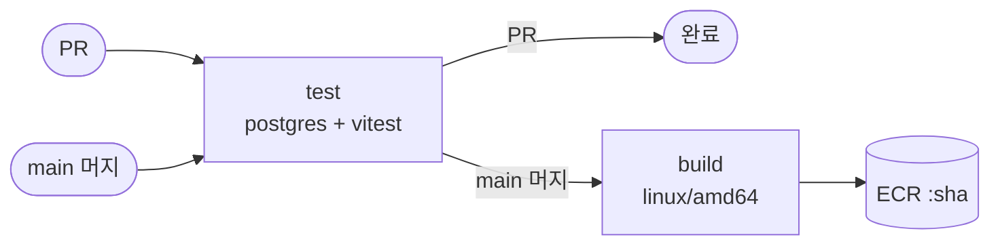
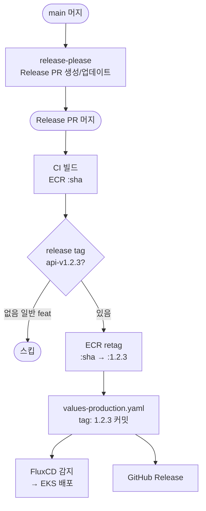
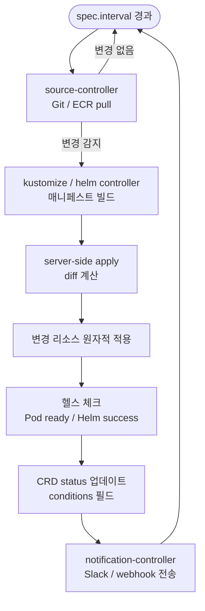
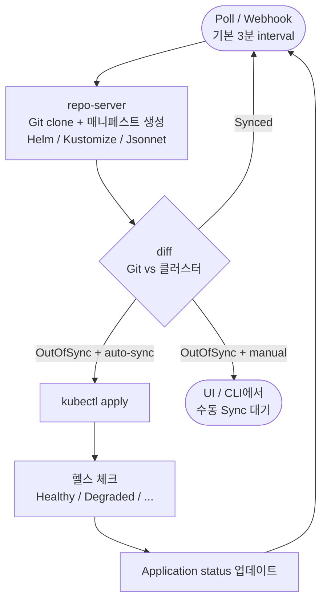

# CI/CD: GitHub Actions + FluxCD

> 기준일: 2026-04-28  
> 구성: CI(GitHub Actions) → ECR Push → CD(FluxCD) → EKS

---

## 목차

1. [전체 아키텍처](#1-전체-아키텍처)
2. [ArgoCD vs FluxCD](#2-argocd-vs-fluxcd)
3. [FluxCD 동작 원리](#3-fluxcd-동작-원리)
4. [ArgoCD 동작 원리](#4-argocd-동작-원리)
5. [필요 권한 정리](#5-필요-권한-정리)
6. [구현 계획](#6-구현-계획)

---

## 1. 전체 아키텍처

### CI 흐름



### Release 흐름



### 핵심 원칙

- **CI와 CD의 분리**: GitHub Actions는 빌드/테스트/푸시만 담당. 배포는 FluxCD가 전담.
- **Build on merge**: main 병합 시마다 `:sha` 이미지 생성 (배포 공백 없음)
- **Release on Release PR**: release-please가 버전 결정, 개발자가 머지 타이밍 결정
- **Retag, not rebuild**: 검증된 `:sha` 이미지를 `:semver`로 복사 (레이어 재업로드 없음)
- **CI가 Git에 직접 커밋**: values-production.yaml 업데이트 → FluxCD 감지 → 배포
- **레이스 컨디션 방지**: deploy job은 `workflow_run`으로 CI 완료 후 실행

---

## 2. ArgoCD vs FluxCD

### 2.1 뭘 더 많이쓰나?

**ArgoCD가 사실상 업계 표준으로 자리잡음.**

| 지표 | ArgoCD | FluxCD |
|------|--------|--------|
| CNCF Survey 2025 점유율 | **약 60%** | ~30% |
| GitHub Stars | 20,000+ | 6,500+ |
| 엔터프라이즈 채택률 | 34% → **67%** (2023→2025) | 감소세 |
| CNCF 상태 | Graduated (2022.12) | Graduated (2022.11) |

**이 프로젝트에서 FluxCD를 선택한 이유**: 인프라 규모와 비용 효율성.

ArgoCD는 argocd-server, repo-server, application-controller, redis, dex 총 5개 Pod를 띄우며 최소 **800MB~1GB RAM**을 점유한다. FluxCD는 동일 기능 대비 **200~300MB** 수준이다.

ArgoCD가 Redis를 필요로 하는 이유는 중앙 API 서버가 여러 컴포넌트 간 상태를 빠르게 공유해야 하기 때문이다. FluxCD는 중앙 API 서버 자체가 없고, 각 컨트롤러가 Kubernetes CRD(etcd)에 직접 상태를 저장하기 때문에 별도 캐시 레이어가 필요 없다.

이 프로젝트는 t3.medium × 2 노드(노드당 유효 RAM ~3.5GB)로 운영된다. CD 툴이 노드 리소스를 600MB 이상 덜 사용하면 애플리케이션 Pod 여유가 늘어나고, 노드 스케일링 임계치가 높아져 직접적인 비용 절감으로 이어진다. ArgoCD의 UI/API 서버는 단일 환경 + 소규모 팀 구조에서 실질적으로 활용되지 않는 리소스 비용이다.

---

### 2.2 아키텍처 철학 비교

| 항목 | ArgoCD | FluxCD |
|------|--------|--------|
| **모델** | 중앙 집중형 허브-앤-스포크 | 분산형 모듈 툴킷 |
| **컨트롤러** | 모놀리식 컨트롤 플레인 | 독립된 전문 컨트롤러 조합 |
| **RBAC** | 앱 수준 RBAC + SSO (Dex) | Kubernetes 네이티브 RBAC만 |
| **다중 클러스터** | 중앙 서버에서 모두 관리 | 각 클러스터에 에이전트 독립 설치 |
| **Image 자동화** | 별도 툴 (Argo Image Updater) | 내장 (Image Reflector + Automation) |
| **보안 공격면** | 외부 노출 API 서버 존재 | 외부 API 없음, 최소 권한 |

---

### 2.3 장단점 심층 비교

#### ArgoCD

**장점**
- 웹 UI로 애플리케이션 토폴로지, 동기화 상태, diff를 시각적으로 확인
- ApplicationSet으로 단일 정의 → 다중 클러스터/네임스페이스 배포
- SSO(OIDC/SAML/LDAP) + 앱 수준 RBAC으로 세밀한 접근 제어
- 거대한 생태계와 풍부한 레퍼런스
- 수동 동기화, diff-without-apply 등 운영 유연성

**단점**
- 외부 노출 API 서버로 인한 보안 공격 면적 증가
- 대규모 클러스터에서 repo-server 병목 가능
- ArgoCD 자체의 접근 권한 관리가 추가 레이어로 복잡해짐

#### FluxCD

**장점**
- 완전 Kubernetes-native: 별도 API 없이 CRD + 컨트롤러만으로 동작
- 모듈형: 필요한 컨트롤러만 선택적으로 설치
- 최소 권한 원칙: 외부 노출 없이 클러스터 내부에서만 작동
- Image Automation 내장으로 ECR 태그 변경 → Git 커밋 → 배포 자동화
- 컨트롤러별 독립적 스케일링

**단점**
- UI 없음 → 상태 확인을 CLI(`flux get`) 또는 모니터링 도구에 의존
- 온보딩 난이도 높음 (모든 설정이 YAML CRD)
- Weaveworks 파산 이후 상업적 지원 불명확 (CNCF 독립성은 확보)
- ArgoCD 대비 레퍼런스/튜토리얼 부족

---

## 3. FluxCD 동작 원리

### 3.1 아키텍처 컴포넌트

FluxCD는 **GitOps Toolkit**이라는 독립 컨트롤러들의 조합으로 구성된다. 각 컨트롤러는 별도의 Pod로 `flux-system` 네임스페이스에 배포된다.

```
flux-system 네임스페이스
├── source-controller          # Git/OCI/Helm/S3에서 아티팩트 수집
├── kustomize-controller       # Kustomization 리소스 조정
├── helm-controller            # HelmRelease 리소스 조정
├── notification-controller    # Slack/Teams/webhook 알림
├── image-reflector-controller # 컨테이너 레지스트리 태그 스캔
└── image-automation-controller# Git 매니페스트 이미지 태그 자동 업데이트
```

#### Source Controller
- Git 리포지토리, OCI 레지스트리, Helm 리포지토리, S3 버킷에서 아티팩트를 가져온다
- 변경 감지 후 tar.gz 아티팩트를 생성해 다른 컨트롤러에 통보
- 관련 CRD: `GitRepository`, `OCIRepository`, `HelmRepository`, `Bucket`

#### Kustomize Controller
- `Kustomization` CRD를 감시해 클러스터 상태를 Git의 선언적 상태와 일치시킨다
- `spec.interval`마다 (기본 5분) 조정 실행
- `spec.prune: true`면 Git에서 제거된 리소스를 클러스터에서도 삭제

#### Helm Controller
- `HelmRelease` CRD를 통해 Helm 차트를 선언적으로 관리
- v2.8부터 Helm v4 + server-side apply + kstatus 기반 헬스 체크 지원

#### Image Reflector Controller
- `ImageRepository` CRD로 컨테이너 레지스트리를 주기적으로 스캔
- `ImagePolicy` CRD로 어떤 태그를 선택할지 정책 정의 (semver, regex 등)
- ECR 접근 시 IRSA를 통한 AWS 인증 사용

#### Image Automation Controller
- Image Reflector가 새 태그를 감지하면, Git 매니페스트의 이미지 참조를 자동으로 업데이트하고 커밋/푸시
- 매니페스트에 마커를 삽입해 업데이트 위치를 지정:
  ```yaml
  image: 893286712531.dkr.ecr.us-east-2.amazonaws.com/devopsim/api:latest # {"$imagepolicy": "flux-system:api"}
  ```

---

### 3.2 Reconciliation Loop (조정 루프)

FluxCD의 핵심은 **Observe → Compare → Act → Report** 사이클의 반복이다.



**Pull 기반 모델의 의미**
- 클러스터 외부 시스템(GitHub Actions 등)이 직접 `kubectl apply`하지 않는다
- 클러스터 안의 컨트롤러가 스스로 Git을 당겨와서 적용
- 따라서 클러스터 API 서버에 대한 외부 인증정보가 CI에 불필요
- 드리프트(누군가 수동으로 클러스터를 변경한 경우)를 자동으로 감지하고 원상 복구

---

### 3.3 Flux v2.8 주요 변경사항 (2026.02 GA)

- **Helm v4 지원**: server-side apply, kstatus 기반 헬스 평가
- **`CancelHealthCheckOnNewRevision`**: 신규 버전 배포 시 이전 헬스체크 즉시 취소 → MTTR 단축
- **ResourceSet API**: GitHub PR에서 임시 Preview 환경 자동 생성
- **PR/MR 코멘트 Provider**: CI 없이 Flux가 직접 GitHub PR에 배포 결과 코멘트
- **Kubernetes 1.33-1.35 지원**

---

## 4. ArgoCD 동작 원리

> 이번 프로젝트에서는 FluxCD를 사용하지만, 비교 학습을 위해 ArgoCD 원리를 정리한다.

### 4.1 아키텍처 컴포넌트

```
argocd 네임스페이스
├── argocd-server          # gRPC/REST API + Web UI 서버 (외부 노출)
├── argocd-repo-server     # Git 리포지토리 클론 및 매니페스트 생성
├── argocd-application-controller  # 애플리케이션 상태 조정 (Kubernetes 컨트롤러)
├── argocd-redis           # 캐싱 레이어 (API 서버 ↔ K8s API 요청 감소)
└── argocd-dex-server      # OIDC/SAML SSO 처리
```

#### API Server
- Web UI, CLI, CI/CD 시스템이 사용하는 gRPC/REST API 제공
- 상태를 갖지 않음 (stateless) → 수평 확장 가능

#### Repository Server
- Git 리포지토리를 로컬에 클론하고 최신 상태로 유지
- Kustomize, Helm, Jsonnet 등으로 최종 매니페스트 생성
- 대규모 환경에서 병목이 될 수 있는 컴포넌트

#### Application Controller
- `Application` CRD를 감시하며 Git의 원하는 상태 vs 클러스터 현재 상태를 지속 비교
- 기본 조정 주기: **3분** (120초 + 최대 60초 지터)
- 자동 동기화 설정 시 차이가 감지되면 즉시 sync 실행

### 4.2 Reconciliation Loop



**FluxCD와의 핵심 차이**
- ArgoCD는 **Application CRD 중심** (앱 단위로 동기화 관리)
- FluxCD는 **소스와 조정을 분리** (Source Controller → Kustomize/Helm Controller)
- ArgoCD는 UI에서 수동 Sync, Rollback, Diff 확인이 직관적
- FluxCD는 모든 것이 `flux` CLI 또는 YAML

### 4.3 주요 릴리즈 (2025-2026)

| 버전 | 출시 | 주요 변경 |
|------|------|---------|
| v3.0 GA | 2025.05 | 아키텍처 개선, RBAC 강화 |
| v3.1 | 2025.08 | OCI Registry 네이티브 지원, CLI 플러그인 |
| v3.2 | 2025.11 | 안정성 개선 |
| v3.3 | 2026.02 | 삭제 안전장치, 인증 UX, repo 성능 최적화 |

---

## 5. 필요 권한 정리

### 5.1 전체 권한 맵

```
GitHub Actions ──(OIDC)──→ AWS IAM Role ──→ ECR Push
                                               │
FluxCD (EKS) ──(IRSA)──→ AWS IAM Role ──→ ECR Pull (이미지 스캔)
     │
     └── Kubernetes RBAC ──→ 클러스터 리소스 조정
```

---

### 5.2 GitHub Actions → ECR (OIDC 방식)

OIDC를 사용하면 AWS Access Key를 GitHub Secrets에 저장할 필요가 없다. GitHub Actions가 발급하는 OIDC 토큰으로 AWS에서 임시 자격증명을 발급받는다.

#### OIDC Provider 등록 (AWS에서 1회 설정)

```
Provider URL: https://token.actions.githubusercontent.com
Audience:     sts.amazonaws.com
```

#### IAM Role Trust Policy

```json
{
  "Version": "2012-10-17",
  "Statement": [
    {
      "Effect": "Allow",
      "Principal": {
        "Federated": "arn:aws:iam::893286712531:oidc-provider/token.actions.githubusercontent.com"
      },
      "Action": "sts:AssumeRoleWithWebIdentity",
      "Condition": {
        "StringEquals": {
          "token.actions.githubusercontent.com:aud": "sts.amazonaws.com",
          "token.actions.githubusercontent.com:sub": "repo:f-lab-edu/devopsim:ref:refs/heads/main"
        }
      }
    }
  ]
}
```

#### IAM Policy (ECR Push 권한)

```json
{
  "Version": "2012-10-17",
  "Statement": [
    {
      "Sid": "ECRPush",
      "Effect": "Allow",
      "Action": [
        "ecr:CompleteLayerUpload",
        "ecr:UploadLayerPart",
        "ecr:InitiateLayerUpload",
        "ecr:BatchCheckLayerAvailability",
        "ecr:PutImage",
        "ecr:BatchGetImage"
      ],
      "Resource": "arn:aws:ecr:us-east-2:893286712531:repository/devopsim/api"
    },
    {
      "Sid": "ECRAuth",
      "Effect": "Allow",
      "Action": "ecr:GetAuthorizationToken",
      "Resource": "*"
    }
  ]
}
```

> `ecr:GetAuthorizationToken`은 리포지토리 단위로 제한 불가 → 반드시 `Resource: "*"` 사용

#### GitHub Actions Workflow 권한

```yaml
jobs:
  build-push:
    permissions:
      id-token: write   # OIDC 토큰 발급
      contents: read    # 리포지토리 체크아웃
```

---

### 5.3 FluxCD → ECR (IRSA 방식)

FluxCD의 `image-reflector-controller`가 ECR에서 이미지 태그를 스캔할 때 필요한 권한이다. EKS IRSA를 통해 서비스 어카운트에 IAM Role을 바인딩한다.

#### IAM Policy (ECR Read 권한)

AWS 관리형 정책 `AmazonEC2ContainerRegistryReadOnly` 사용 권장.

커스텀 정책이 필요하면:

```json
{
  "Version": "2012-10-17",
  "Statement": [
    {
      "Sid": "ECRRead",
      "Effect": "Allow",
      "Action": [
        "ecr:GetAuthorizationToken",
        "ecr:BatchGetImage",
        "ecr:GetDownloadUrlForLayer",
        "ecr:DescribeRepositories",
        "ecr:DescribeImages",
        "ecr:ListImages",
        "ecr:BatchCheckLayerAvailability"
      ],
      "Resource": "*"
    }
  ]
}
```

#### IAM Role Trust Policy (IRSA)

```json
{
  "Version": "2012-10-17",
  "Statement": [
    {
      "Effect": "Allow",
      "Principal": {
        "Federated": "arn:aws:iam::893286712531:oidc-provider/oidc.eks.us-east-2.amazonaws.com/id/<EKS_OIDC_ID>"
      },
      "Action": "sts:AssumeRoleWithWebIdentity",
      "Condition": {
        "StringEquals": {
          "oidc.eks.us-east-2.amazonaws.com/id/<EKS_OIDC_ID>:sub": "system:serviceaccount:flux-system:image-reflector-controller",
          "oidc.eks.us-east-2.amazonaws.com/id/<EKS_OIDC_ID>:aud": "sts.amazonaws.com"
        }
      }
    }
  ]
}
```

#### FluxCD ImageRepository CRD

```yaml
apiVersion: image.toolkit.fluxcd.io/v1beta2
kind: ImageRepository
metadata:
  name: api
  namespace: flux-system
spec:
  image: 893286712531.dkr.ecr.us-east-2.amazonaws.com/devopsim/api
  interval: 1m
  provider: aws   # IRSA 기반 ECR 인증 자동 처리
```

---

### 5.4 FluxCD Kubernetes RBAC

FluxCD bootstrap 시 자동 생성되지만, 원리 이해를 위해 정리.

각 컨트롤러는 자체 ServiceAccount를 가지며, 필요한 CRD와 클러스터 리소스에 대한 ClusterRole이 바인딩된다.

| 컨트롤러 | 필요 권한 |
|---------|---------|
| source-controller | GitRepository, HelmRepository, OCIRepository, Bucket CRD R/W |
| kustomize-controller | Kustomization CRD R/W + 클러스터 전체 리소스 Apply (impersonation) |
| helm-controller | HelmRelease CRD R/W + 클러스터 전체 리소스 Apply |
| image-reflector-controller | ImageRepository, ImagePolicy CRD R/W |
| image-automation-controller | ImageUpdateAutomation CRD R/W + Git 쓰기 (SSH key로) |
| notification-controller | Alert, Provider, Receiver CRD R/W |

---

### 5.5 권한 요약표

| 컴포넌트 | 권한 타입 | 핵심 권한 |
|---------|---------|---------|
| GitHub Actions | AWS IAM (OIDC) | ECR Push + GetAuthorizationToken |
| FluxCD image-reflector | AWS IAM (IRSA) | ECR Read (AmazonEC2ContainerRegistryReadOnly) |
| FluxCD image-automation | Git 접근 | SSH Deploy Key (GitHub repo write 권한) |
| FluxCD kustomize/helm | Kubernetes RBAC | ClusterAdmin 수준 (bootstrap이 자동 설정) |
| FluxCD source | Kubernetes RBAC | Flux CRD R/W |

---

## 6. 구현

### 전략 결정 요약

| 항목 | 결정 | 이유 |
|------|------|------|
| 빌드 트리거 | main merge 시 `:sha` 빌드 | 배포 공백 없음, 빠른 피드백 |
| 릴리즈 트리거 | `api/v1.2.3` 태그 시 `:semver` retag | 명시적 릴리즈 결정 |
| 버전 관리 | 서비스 프리픽스 태그 (`api/v1.2.3`) | 모노레포 서비스 독립 버전 관리 |
| CD 업데이트 방식 | CI가 values-production.yaml 커밋 | Flux Image Automation 대비 단순, 디버깅 쉬움 |
| Image Automation | 미사용 | 단일 환경 + 소규모 팀에서 복잡도 대비 이득 없음 |
| 다중 서비스 감지 | `packages/shared/**` 변경 시 전체 서비스 dirty | 공유 패키지 의존성 처리 |

### 구현된 파일

```
.github/workflows/
  ci.yaml        # PR + main push: detect → test → build
  release.yaml   # tag push: retag → values 업데이트 → Git push → GitHub Release
```

### ci.yaml 핵심 동작

| Job | 트리거 조건 | 주요 작업 |
|-----|-----------|---------|
| `detect` | 항상 | `dorny/paths-filter`로 api/shared 변경 감지 |
| `test` | api 또는 shared 변경 | postgres 서비스 컨테이너 + migrate + vitest |
| `build` | push to main + test 통과 | `linux/amd64` 빌드 + ECR `:sha` push (GHA 캐시) |

### release.yaml 핵심 동작

1. 태그(`api/v1.2.3`) 파싱 → `SERVICE`, `VERSION`, `TAG_SHA` 추출
2. ECR `batch-get-image` + `put-image`로 `:sha` → `:1.2.3` retag (레이어 재업로드 없음)
3. `infra/helm/api/values-production.yaml` tag 필드 업데이트
4. `git push main [skip ci]` → FluxCD가 감지해서 EKS 배포
5. GitHub Release 생성 (`gh release create`)

### 다음 단계: CD (FluxCD)

```
infra/flux/
  clusters/
    production/
      flux-system/     # flux bootstrap 생성 파일
      apps/
        api.yaml       # HelmRelease (values-production.yaml 참조)
```

FluxCD는 `values-production.yaml`의 `tag` 값이 바뀌면 HelmRelease를 자동으로 조정한다. Image Automation은 사용하지 않는다.

---

## 참고 자료

- [FluxCD 공식 문서](https://fluxcd.io/flux/)
- [Flux v2.8 GA 릴리즈 노트](https://fluxcd.io/blog/2026/02/flux-v2.8.0/)
- [ArgoCD 공식 문서](https://argo-cd.readthedocs.io/en/stable/)
- [CNCF End User Survey 2025 - ArgoCD 채택](https://www.cncf.io/announcements/2025/07/24/cncf-end-user-survey-finds-argo-cd-as-majority-adopted-gitops-solution-for-kubernetes/)
- [GitHub OIDC + AWS 설정](https://docs.github.com/en/actions/security-for-github-actions/security-hardening-your-deployments/configuring-openid-connect-in-amazon-web-services)
- [Flux AWS 통합 가이드](https://fluxcd.io/flux/integrations/aws/)
